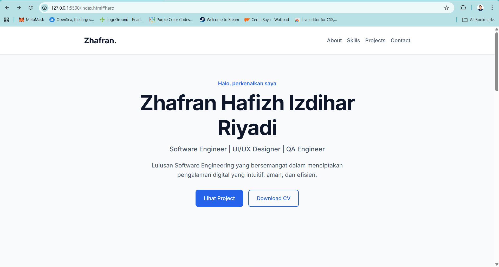
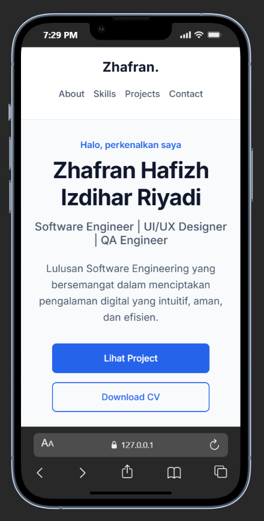

# Portfolio | Zhafran Hafizh Izdihar Riyadi

Personal portfolio website built manually with Semantic HTML5 & CSS3. This project is a homework assignment for the Dicoding Karir Elevation Vol. 2 program.

## 🔗 Links
- **Live Demo:** [https://zhafranhafizh.github.io/HomeworkPorto/](https://zhafranhafizh.github.io/HomeworkPorto/)
- **Repository:** [https://github.com/ZhafranHafizh/HomeworkPorto.git](https://github.com/ZhafranHafizh/HomeworkPorto.git)

## 🛠️ Technologies Used
- HTML5 (Semantic)
- CSS3 (Flexbox, Grid, Responsive Design)

## 📱 Responsive Preview

### Desktop View

### Mobile View

## 🧠 What I Learned
Membuat website dengan bantuan AI tetap membutuhkan proses berpikir yang jelas. Dengan pendekatan RTCC-O, prompt menjadi lebih terarah karena role, task, context, constraints, dan output sudah didefinisikan sejak awal.

## 🚀 Challenges & Solutions
**Challenge:** Merapihkan CSS yang belum sempurna.  
**Solution:** Dikarenakan struktur kode CSS saya buat dengan jelas (dibagi per section), proses debugging dan penyesuaian layout menjadi lebih mudah dan terarah.

---
*Created by Zhafran Hafizh I.R - 04/05/2026*
