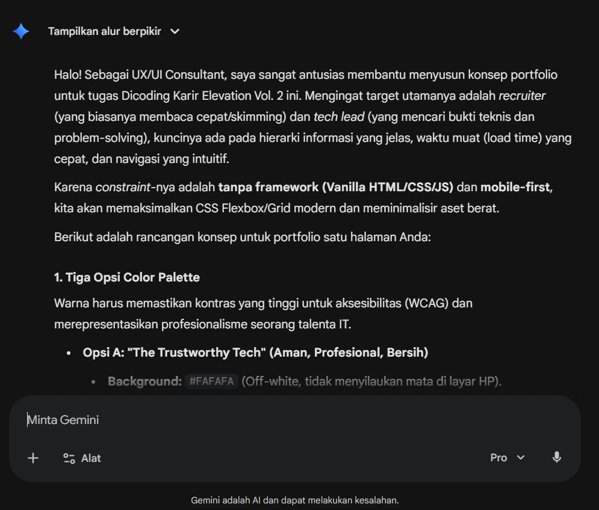
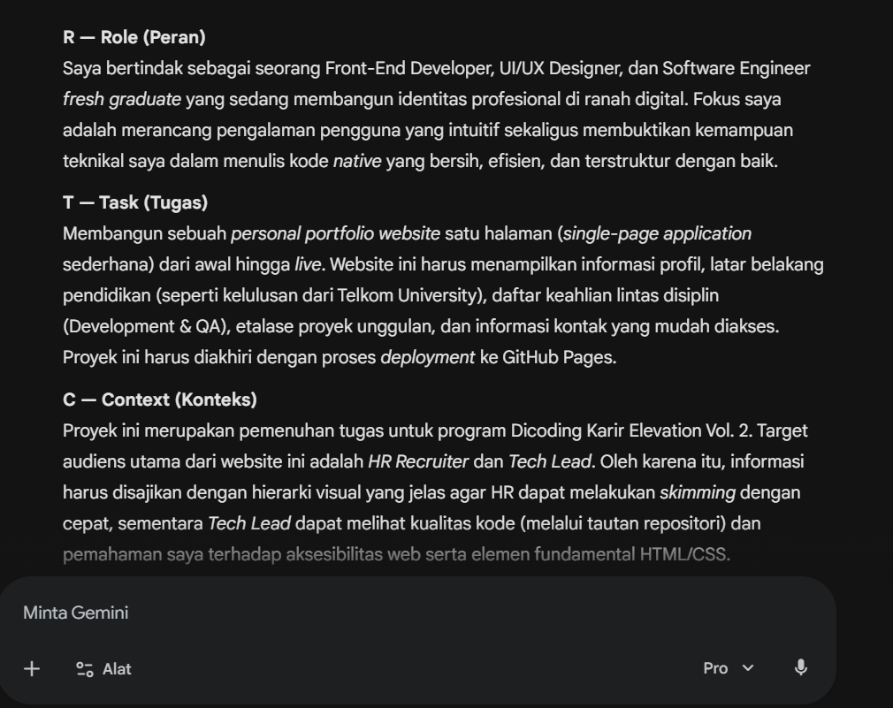
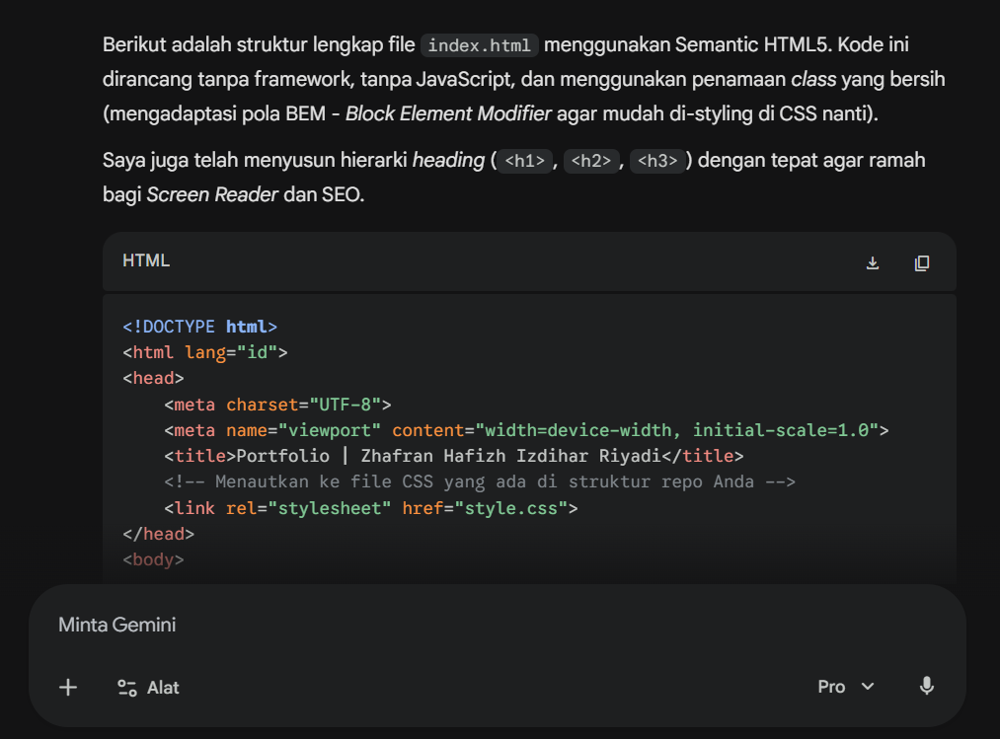
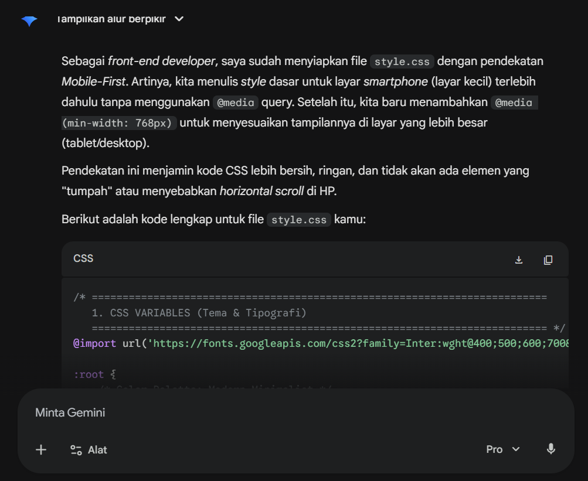

# 03 - Execution

## Prinsip

Setiap step dilakukan secara bertahap agar saya tidak hanya menerima hasil akhir dari AI, tetapi juga memahami proses dan alasan di balik setiap perubahan.

SETIAP STEP:
1. Kirim prompt ke AI
2. Review output AI
3. Fix jika perlu
4. Lanjut step berikutnya

## Step 1: Brainstorm Portfolio Direction

### Prompt
Role:
Kamu adalah UX/UI consultant untuk portfolio developer.

Task:
Bantu saya brainstorm konsep portfolio website untuk fresh graduate IT.

Context:
Saya ingin membuat portfolio satu halaman untuk tugas Dicoding KAreerr Elevation Vol. 2. Portfolio ini akan digunakan untuk menampilkan profil, skill, project, dan kontak. Target pembaca portfolio adalah recruiter HR dan tech lead.

Constraints:
- Mobile-first
- Simple tetapi stand out
- Tidak menggunakan framework
- Harus mudah dibaca
- Harus cocok untuk fresh graduate IT

Output:
Berikan:
1. 3 color palette options
2. Typography recommendation
3. Section structure
4. 1 unique element yang bisa membuat portfolio lebih menarik

### RTCC-O Check
R: ✅
T: ✅
C: ✅
C: ✅
O: ✅

### AI Response

### Review 
- [✅] Sesuai constraints?
- [✅] Format sesuai?
- [✅] Bisa dipahami?
Changes: Saya memilih pendekatan modern minimalis karena lebih sesuai untuk portfolio developer dan mudah dibaca oleh recruiter.

---

## Step 2: Define Project Details Using RTCC-O

### Prompt
Role:
Kamu adalah senior front-end developer sekaligus mentor yang membantu saya membuat portfolio dengan HTML semantik dan CSS responsive.

Task:
Bantu saya menyusun detail project menggunakan framework RTCC-O.

Context:
Project ini adalah tugas Dicoding KAreerr Elevation Vol. 2. Saya harus membuat portfolio website dengan HTML dan CSS, lalu deploy ke GitHub Pages. Portfolio harus memiliki dokumentasi proses di folder plan.

Constraints:
- Menggunakan HTML5 dan CSS3
- Mobile-first
- Menggunakan semantic HTML
- Tidak menggunakan framework
- Kode harus mudah saya pahami dan bisa saya jelaskan
- Output harus sesuai struktur repository tugas

Output:
Buat detail project berdasarkan:
R — Role
T — Task
C — Context
C — Constraints
O — Output

### RTCC-O Check
R: ✅
T: ✅
C: ✅
C: ✅
O: ✅

### AI Response

### Review 
- [✅] Sesuai constraints?
- [✅] Format sesuai?
- [✅] Bisa dipahami?
Changes: Saya menyesuaikan beberapa bagian agar lebih sesuai dengan kebutuhan portfolio pribadi saya.

---

## Step 3: Create HTML Structure

### Prompt
Role:
Kamu adalah senior front-end developer dengan keahlian semantic HTML.

Task:
Bantu saya membuat struktur index.html untuk portfolio website satu halaman.

Context:
Portfolio ini dibuat untuk fresh graduate IT. Section yang dibutuhkan adalah header/navigation, hero, about, skills, projects, contact, dan footer. Website akan di-deploy ke GitHub Pages.

Constraints:
- Gunakan semantic HTML5
- Jangan gunakan framework
- Jangan gunakan JavaScript
- Struktur harus mudah dipahami
- Gunakan class name yang jelas
- Pastikan semua section memiliki heading yang sesuai

Output:
Berikan kode lengkap untuk file index.html.

### RTCC-O Check
R: ✅
T: ✅
C: ✅
C: ✅
O: ✅

### AI Response

### Review 
- [✅] Sesuai constraints?
- [✅] Format sesuai?
- [✅] Bisa dipahami?

---

## Step 4: Create Responsive CSS

### Prompt
Role:
Kamu adalah front-end developer senior yang berpengalaman membuat responsive CSS mobile-first.

Task:
Bantu saya membuat style.css untuk portfolio website satu halaman.

Context:
HTML sudah memiliki section header, hero, about, skills, projects, contact, dan footer. Desain yang diinginkan adalah modern minimalis, clean, mudah dibaca, dan cocok untuk portfolio developer.

Constraints:
- Mobile-first
- Tidak menggunakan framework
- Tidak menggunakan CSS yang terlalu kompleks
- Harus responsive untuk mobile dan desktop
- Gunakan spacing dan typography yang nyaman
- Pastikan tidak ada horizontal scroll

Output:
Berikan kode lengkap untuk file style.css dan jelaskan singkat bagian pentingnya.

### RTCC-O Check
R: ✅
T: ✅
C: ✅
C: ✅
O: ✅

### AI Response

### Review 
- [✅] Sesuai constraints?
- [✅] Format sesuai?
- [✅] Bisa dipahami?
Changes: Penyesuaian margin kiri & kanan, Hero section kurang di tengah.

---

