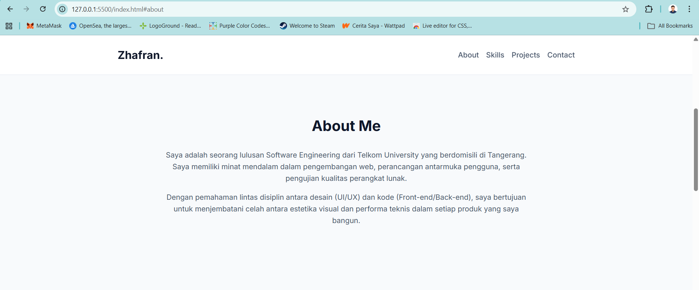
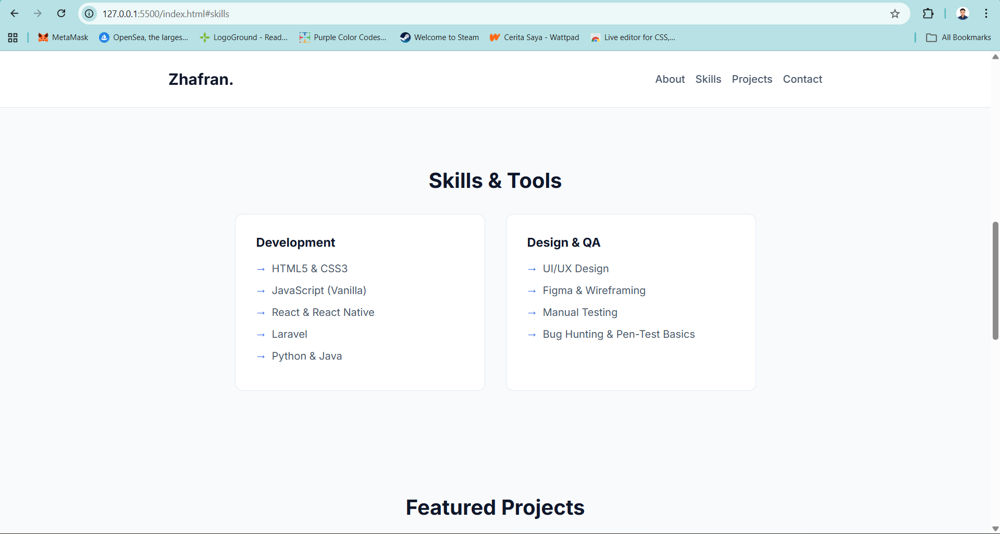
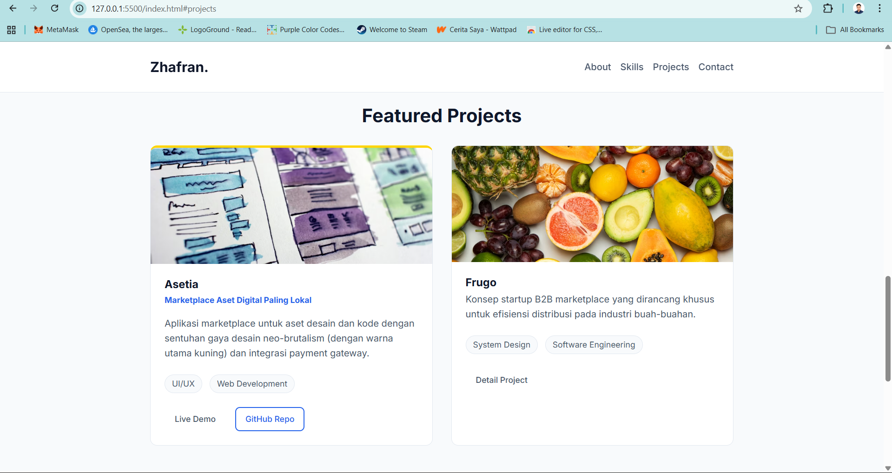
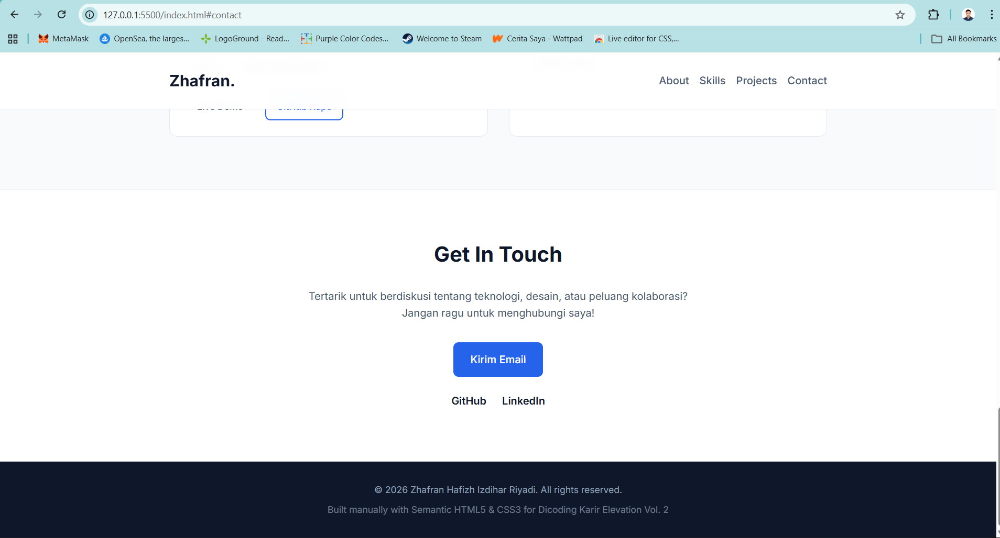

```md
# Final Results — Zhafran

## Portfolio Info

- **Nama:** Zhafran Hafizh I.R
- **Repository:** https://github.com/ZhafranHafizh/HomeworkPorto.git 
- **Live URL:** https://zhafranhafizh.github.io/HomeworkPorto/
- **Date:** 04/05/2026

---

## Screenshot: Desktop







Screenshot desktop menunjukkan tampilan portfolio dalam ukuran layar laptop/desktop. Semua section utama seperti hero, about, skills, projects, contact, dan footer dapat terlihat dengan layout yang rapi.

---

## Screenshot: Mobile


Screenshot mobile menunjukkan bahwa portfolio sudah responsive dan dapat dibaca dengan baik pada ukuran layar kecil. Layout disusun secara vertikal agar nyaman digunakan di perangkat mobile.

---

## What I Learned

1. Saya belajar bahwa membuat website dengan bantuan AI tetap membutuhkan proses berpikir yang jelas. Dengan pendekatan RTCC-O, prompt menjadi lebih terarah karena role, task, context, constraints, dan output sudah didefinisikan sejak awal.

---

## Challenges & Solutions

### Challenge 1: Merapihkan CSS yang belum sempurna

**How I Solved:**
Diakrenakan file css saya sudah terbagi jadi per section, jadinya saya lebih mudah melakukan
debugging dan memahami apa yang perlu di perbaiki.

---

## Checklist

```txt
[✅] Desktop screenshot ada
[✅] Mobile screenshot ada
[✅] No horizontal scroll
[✅] All sections visible
[✅] 3+ insights documented
[✅] Challenges solved documented
[✅] GitHub Pages URL available